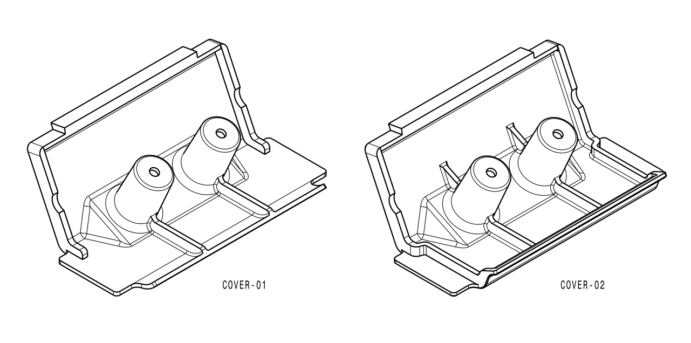

## Angaben für PrusaSlicer

**Cover:**
* PETG
* Nozzel 0,4 mm
* Schichthöhe 0,2 mm
* Infill 100%
* Stützen: Stützen nur auf dem Druckbett

**Bracket LH/RH**
* PETG
* Nozzel 0,4 mm
* Schichthöhe 0,2 mm
* Perimeter 3
* Infill 50%
* auf der Achse der M6-Verschraubung Modifizierer, Zylinder ø12 mm, hinzugefügt: Infill 100%
* Stützen: Stützen nur auf dem Druckbett

## UPDATE 2024-02-09

**Cover-02:** wegen Optimierung des Spritzschutzes die seitliche Rippen geschlossen und Kragen zum Kennzeichenhalter verlängert
